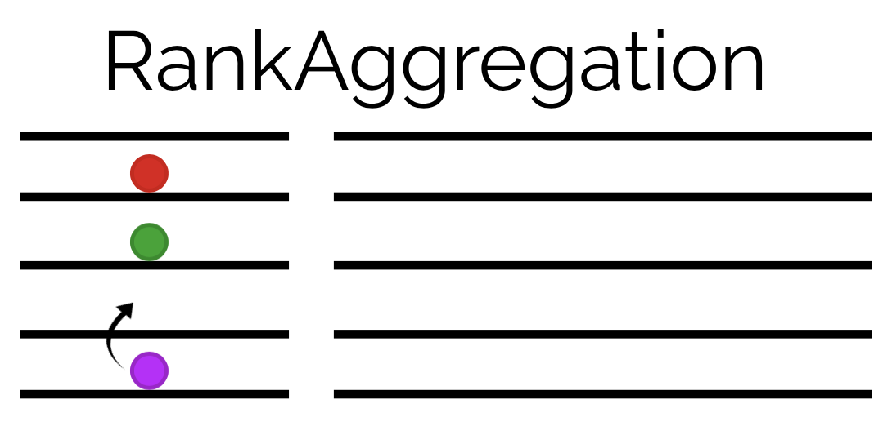

<p align="center">
  <br>
  <a href="https://github.com/JuliaEarth/RankAggregation.jl/actions">
    
  </a>
  <a href="https://codecov.io/gh/JuliaEarth/RankAggregation.jl">
    
  </a>
  <a href="LICENSE">
    
  </a>
</p>

Given a set of objects (e.g. rows of a table) with scores
given by different scoring methods (e.g. columns), how to
rank the objects? This problem is known in the literature
as the rank aggregation problem.

The problem is trivial when there is only one score for
each object (one column), but ranking objects on the basis
of multiple (conflicting) scores is challenging. This
package provides algorithms to aggregate multiple scores
stored in a tabular format
(see [Tables.jl](https://github.com/JuliaData/Tables.jl))
into a final rank vector.

## Installation

Get the latest stable release with Julia's package manager:

```julia
] add RankAggregation
```

## Usage

Given a table with scores `score1` and `score2` for objects `a`, `b`, and `c`:

```julia
julia> using DataFrames
julia> using RankAggregation

julia> objects = DataFrame(object=[:a,:b,:c], score1=[0.9, 0.7, 0.5], score2=[0.8, 0.9, 0.4])
3×3 DataFrame
│ Row │ object │ score1  │ score2  │
│     │ Symbol │ Float64 │ Float64 │
├─────┼────────┼─────────┼─────────┤
│ 1   │ a      │ 0.9     │ 0.8     │
│ 2   │ b      │ 0.7     │ 0.9     │
│ 3   │ c      │ 0.5     │ 0.4     │
```

rank the objects using:

```julia
julia> rank(objects, :score1)
3-element Array{Int64,1}:
 1
 2
 3

 julia> rank(objects, :score2)
3-element Array{Int64,1}:
 2
 1
 3

 julia> rank(objects, (:score1,:score2))
3-element Array{Int64,1}:
 1
 2
 3
```

Optionally, specify the aggregation method:

```julia
julia> rank(objects, (:score1,:score2), TauModel())
3-element Array{Int64,1}:
 1
 2
 3
```

and the reverse option:

```julia
julia> rank(objects, (:score1,:score2), rev=true)
3-element Array{Int64,1}:
 3
 2
 1
```

## Aggregation Methods

| Method | References |
|--------|------------|
| `TauModel` | Journel 2002. Combining Knowledge From Diverse Sources: An Alternative to Traditional Data Independence Hypotheses. |

## Contributing

Contributions are very welcome, as are feature requests and suggestions.

Please [open an issue](https://github.com/JuliaEarth/RankAggregation.jl/issues) if you encounter
any problems.
